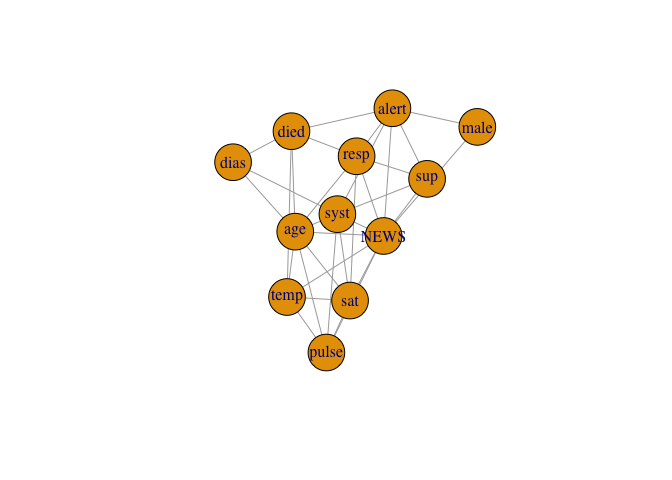

<!-- README.md is generated from README.Rmd. Please edit that file -->

# hume

<!-- badges: start -->
<!-- badges: end -->

The hume package implements the latent Gaussian and the latent Gaussian
copula modeling approaches to learning mixed high dimensional graphs in
a fast and easy-to-use manner.

## Installation

You can install the development version of hume from
[GitHub](https://github.com/) with:

``` r
# install.packages("devtools")
devtools::install_github("konstantingoe/hume")
```

## Example

The package can be applied on continuous only (then it boils down to the
nonparanormal SKEPTIC) and any mix of discrete and continuous variables.

``` r
library(hume)
library(NHSRdatasets) # load synthetic example dataset 
data(synthetic_news_data)
Omega <- mixed.graph.nonpara(synthetic_news_data, param = 0, names = T) # set additional high-dim penalty to 0
#> Warning, there are no factors in the input data.
#>         I'm checking your input and declare factors for level(x)<20
Omega
#> $`Estimated Precision Matrix`
#>                male          age          NEWS          syst        dias
#> male   1.0000000000  0.000000000 -0.0003889412  0.0000000000  0.00000000
#> age    0.0000000000  1.000000000  0.0109049572  0.1054035295 -0.07876774
#> NEWS  -0.0003871658  0.010914240  1.0000000000 -0.1030192524  0.00000000
#> syst   0.0000000000  0.105406936 -0.1030273602  1.0000000000  0.49474370
#> dias   0.0000000000 -0.078766409  0.0000000000  0.4947408511  1.00000000
#> temp   0.0000000000 -0.001535855 -0.0723114387  0.0000000000  0.00000000
#> pulse  0.0000000000 -0.001400754  0.2310800653 -0.0125942798  0.00000000
#> resp   0.0000000000  0.057042814  0.3565800395  0.0000000000  0.00000000
#> sat    0.0000000000 -0.117153535 -0.1383588685 -0.0064014311  0.00000000
#> sup    0.0000000000  0.000000000  0.4143628121 -0.0099041303  0.00000000
#> alert  0.0721267024  0.000000000  0.3360421486  0.0004686131  0.00000000
#> died   0.0000000000  0.188479529  0.0000000000  0.0000000000 -0.02625820
#>               temp        pulse         resp          sat          sup
#> male   0.000000000  0.000000000  0.000000000  0.000000000  0.000000000
#> age   -0.001536439 -0.001400815  0.057045025 -0.117154731  0.000000000
#> NEWS  -0.072308373  0.231079104  0.356567594 -0.138353092  0.414357242
#> syst   0.000000000 -0.012597114  0.000000000 -0.006399583 -0.009914372
#> dias   0.000000000  0.000000000  0.000000000  0.000000000  0.000000000
#> temp   1.000000000  0.182275838  0.000000000 -0.044609372  0.000000000
#> pulse  0.182274650  1.000000000  0.000000000 -0.054145370  0.000000000
#> resp   0.000000000  0.000000000  1.000000000 -0.018094443  0.007191122
#> sat   -0.044609150 -0.054145701 -0.018089743  1.000000000  0.000000000
#> sup    0.000000000  0.000000000  0.007187248  0.000000000  1.000000000
#> alert  0.000000000  0.000000000 -0.062989103  0.000000000  0.242081532
#> died  -0.001156476  0.000000000  0.001599706  0.000000000  0.000000000
#>               alert         died
#> male   0.0721265015  0.000000000
#> age    0.0000000000  0.188479949
#> NEWS   0.3360280299  0.000000000
#> syst   0.0004731307  0.000000000
#> dias   0.0000000000 -0.026258630
#> temp   0.0000000000 -0.001157091
#> pulse  0.0000000000  0.000000000
#> resp  -0.0629786291  0.001597744
#> sat    0.0000000000  0.000000000
#> sup    0.2420868814  0.000000000
#> alert  1.0000000000  0.301314736
#> died   0.3013140844  1.000000000
#> 
#> $`Adjacency Matrix`
#>        male   age  NEWS  syst  dias  temp pulse  resp   sat   sup alert  died
#> male   TRUE FALSE  TRUE FALSE FALSE FALSE FALSE FALSE FALSE FALSE  TRUE FALSE
#> age   FALSE  TRUE  TRUE  TRUE  TRUE  TRUE  TRUE  TRUE  TRUE FALSE FALSE  TRUE
#> NEWS   TRUE  TRUE  TRUE  TRUE FALSE  TRUE  TRUE  TRUE  TRUE  TRUE  TRUE FALSE
#> syst  FALSE  TRUE  TRUE  TRUE  TRUE FALSE  TRUE FALSE  TRUE  TRUE  TRUE FALSE
#> dias  FALSE  TRUE FALSE  TRUE  TRUE FALSE FALSE FALSE FALSE FALSE FALSE  TRUE
#> temp  FALSE  TRUE  TRUE FALSE FALSE  TRUE  TRUE FALSE  TRUE FALSE FALSE  TRUE
#> pulse FALSE  TRUE  TRUE  TRUE FALSE  TRUE  TRUE FALSE  TRUE FALSE FALSE FALSE
#> resp  FALSE  TRUE  TRUE FALSE FALSE FALSE FALSE  TRUE  TRUE  TRUE  TRUE  TRUE
#> sat   FALSE  TRUE  TRUE  TRUE FALSE  TRUE  TRUE  TRUE  TRUE FALSE FALSE FALSE
#> sup   FALSE FALSE  TRUE  TRUE FALSE FALSE FALSE  TRUE FALSE  TRUE  TRUE FALSE
#> alert  TRUE FALSE  TRUE  TRUE FALSE FALSE FALSE  TRUE FALSE  TRUE  TRUE  TRUE
#> died  FALSE  TRUE FALSE FALSE  TRUE  TRUE FALSE  TRUE FALSE FALSE  TRUE  TRUE
#> 
#> $`Sample Correlation Matrix`
#>                male          age        NEWS         syst         dias
#> male   1.0000000000 -0.008656841 -0.01576318 -0.008724568 -0.035326347
#> age   -0.0086568410  1.000000000  0.19401823  0.133900540 -0.129582513
#> NEWS  -0.0157631779  0.194018235  1.00000000 -0.283470249 -0.181360974
#> syst  -0.0087245675  0.133900540 -0.28347025  1.000000000  0.613885731
#> dias  -0.0353263469 -0.129582513 -0.18136097  0.613885731  1.000000000
#> temp  -0.0521080350 -0.075554446 -0.11325741  0.006506684 -0.010126381
#> pulse -0.0546670214 -0.030492017  0.45068846 -0.162117689 -0.040197512
#> resp  -0.0016983831  0.185907723  0.58267107 -0.023484723  0.006326199
#> sat    0.0008456623 -0.232262871 -0.34507732 -0.040671662 -0.001071250
#> sup    0.0794093641  0.138114498  0.76310556 -0.218025226 -0.088724237
#> alert  0.1801641959  0.166264229  0.70829906 -0.047631631 -0.079011617
#> died   0.0313828998  0.313482223  0.33013831 -0.006185895 -0.145319105
#>               temp       pulse         resp           sat         sup
#> male  -0.052108035 -0.05466702 -0.001698383  0.0008456623  0.07940936
#> age   -0.075554446 -0.03049202  0.185907723 -0.2322628715  0.13811450
#> NEWS  -0.113257414  0.45068846  0.582671074 -0.3450773170  0.76310556
#> syst   0.006506684 -0.16211769 -0.023484723 -0.0406716622 -0.21802523
#> dias  -0.010126381 -0.04019751  0.006326199 -0.0010712499 -0.08872424
#> temp   1.000000000  0.25021272  0.017311335 -0.1250114139  0.04489316
#> pulse  0.250212718  1.00000000  0.231194171 -0.2317765702  0.17845530
#> resp   0.017311335  0.23119417  1.000000000 -0.2257830382  0.39280728
#> sat   -0.125011414 -0.23177657 -0.225783038  1.0000000000 -0.11623695
#> sup    0.044893158  0.17845530  0.392807283 -0.1162369509  1.00000000
#> alert -0.090865594  0.15088859  0.173023674 -0.1151245309  0.65075574
#> died  -0.085443245  0.13540876  0.190669493 -0.0520274985  0.27611813
#>             alert         died
#> male   0.18016420  0.031382900
#> age    0.16626423  0.313482223
#> NEWS   0.70829906  0.330138312
#> syst  -0.04763163 -0.006185895
#> dias  -0.07901162 -0.145319105
#> temp  -0.09086559 -0.085443245
#> pulse  0.15088859  0.135408757
#> resp   0.17302367  0.190669493
#> sat   -0.11512453 -0.052027499
#> sup    0.65075574  0.276118131
#> alert  1.00000000  0.495682375
#> died   0.49568237  1.000000000
#> 
#> $Edgenumber
#> [1] 33
#> 
#> $`Max Degree`
#> [1] 9
#> 
#> $initial_mat_singular
#> [1] FALSE
require(igraph)
#> Loading required package: igraph
#> 
#> Attaching package: 'igraph'
#> The following objects are masked from 'package:stats':
#> 
#>     decompose, spectrum
#> The following object is masked from 'package:base':
#> 
#>     union
# plot from adjacency matrix
plot(graph_from_adjacency_matrix(Omega$`Adjacency Matrix`, mode = "undirected", diag = F),vertex.size=30)
```


