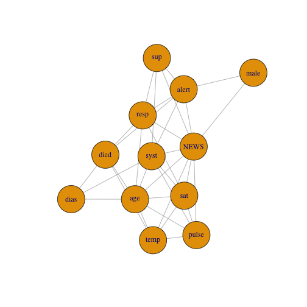

<!-- README.md is generated from README.Rmd. Please edit that file -->


# hume

<!-- badges: start -->
<!-- badges: end -->

The hume package implements the latent Gaussian and the latent Gaussian copula modeling approaches to learning mixed high dimensional graphs in a fast and easy-to-use manner.  

## Installation

You can install the development version of hume from [GitHub](https://github.com/) with:

``` r
# install.packages("devtools")
devtools::install_github("konstantingoe/hume")
```

## Example

The package can be applied on continuous only (then it boils down to the nonparanormal SKEPTIC) and any mix of discrete and continuous variables.


```r
library(hume)
library(NHSRdatasets) # load synthetic example dataset 
data(synthetic_news_data)

Omega <- mixed.graph.nonpara(synthetic_news_data, param = 0) # set additional high-dim penalty to 0
#> Warning, there are no factors in the input data.
#>         I'm checking your input and declare factors for level(x)<20
Omega
#> $`Estimated Precision Matrix`
#>                [,1]         [,2]          [,3]          [,4]        [,5]         [,6]         [,7]
#>  [1,]  1.0000000000  0.000000000 -0.0003889412  0.0000000000  0.00000000  0.000000000  0.000000000
#>  [2,]  0.0000000000  1.000000000  0.0109049572  0.1054035295 -0.07876774 -0.001536439 -0.001400815
#>  [3,] -0.0003871658  0.010914240  1.0000000000 -0.1030192524  0.00000000 -0.072308373  0.231079104
#>  [4,]  0.0000000000  0.105406936 -0.1030273602  1.0000000000  0.49474370  0.000000000 -0.012597114
#>  [5,]  0.0000000000 -0.078766409  0.0000000000  0.4947408511  1.00000000  0.000000000  0.000000000
#>  [6,]  0.0000000000 -0.001535855 -0.0723114387  0.0000000000  0.00000000  1.000000000  0.182275838
#>  [7,]  0.0000000000 -0.001400754  0.2310800653 -0.0125942798  0.00000000  0.182274650  1.000000000
#>  [8,]  0.0000000000  0.057042814  0.3565800395  0.0000000000  0.00000000  0.000000000  0.000000000
#>  [9,]  0.0000000000 -0.117153535 -0.1383588685 -0.0064014311  0.00000000 -0.044609150 -0.054145701
#> [10,]  0.0000000000  0.000000000  0.4143628121 -0.0099041303  0.00000000  0.000000000  0.000000000
#> [11,]  0.0721267024  0.000000000  0.3360421486  0.0004686131  0.00000000  0.000000000  0.000000000
#> [12,]  0.0000000000  0.188479529  0.0000000000  0.0000000000 -0.02625820 -0.001156476  0.000000000
#>               [,8]         [,9]        [,10]         [,11]        [,12]
#>  [1,]  0.000000000  0.000000000  0.000000000  0.0721265015  0.000000000
#>  [2,]  0.057045025 -0.117154731  0.000000000  0.0000000000  0.188479949
#>  [3,]  0.356567594 -0.138353092  0.414357242  0.3360280299  0.000000000
#>  [4,]  0.000000000 -0.006399583 -0.009914372  0.0004731307  0.000000000
#>  [5,]  0.000000000  0.000000000  0.000000000  0.0000000000 -0.026258630
#>  [6,]  0.000000000 -0.044609372  0.000000000  0.0000000000 -0.001157091
#>  [7,]  0.000000000 -0.054145370  0.000000000  0.0000000000  0.000000000
#>  [8,]  1.000000000 -0.018094443  0.007191122 -0.0629786291  0.001597744
#>  [9,] -0.018089743  1.000000000  0.000000000  0.0000000000  0.000000000
#> [10,]  0.007187248  0.000000000  1.000000000  0.2420868814  0.000000000
#> [11,] -0.062989103  0.000000000  0.242081532  1.0000000000  0.301314736
#> [12,]  0.001599706  0.000000000  0.000000000  0.3013140844  1.000000000
#> 
#> $`Adjacency Matrix`
#>        [,1]  [,2]  [,3]  [,4]  [,5]  [,6]  [,7]  [,8]  [,9] [,10] [,11] [,12]
#>  [1,]  TRUE FALSE  TRUE FALSE FALSE FALSE FALSE FALSE FALSE FALSE  TRUE FALSE
#>  [2,] FALSE  TRUE  TRUE  TRUE  TRUE  TRUE  TRUE  TRUE  TRUE FALSE FALSE  TRUE
#>  [3,]  TRUE  TRUE  TRUE  TRUE FALSE  TRUE  TRUE  TRUE  TRUE  TRUE  TRUE FALSE
#>  [4,] FALSE  TRUE  TRUE  TRUE  TRUE FALSE  TRUE FALSE  TRUE  TRUE  TRUE FALSE
#>  [5,] FALSE  TRUE FALSE  TRUE  TRUE FALSE FALSE FALSE FALSE FALSE FALSE  TRUE
#>  [6,] FALSE  TRUE  TRUE FALSE FALSE  TRUE  TRUE FALSE  TRUE FALSE FALSE  TRUE
#>  [7,] FALSE  TRUE  TRUE  TRUE FALSE  TRUE  TRUE FALSE  TRUE FALSE FALSE FALSE
#>  [8,] FALSE  TRUE  TRUE FALSE FALSE FALSE FALSE  TRUE  TRUE  TRUE  TRUE  TRUE
#>  [9,] FALSE  TRUE  TRUE  TRUE FALSE  TRUE  TRUE  TRUE  TRUE FALSE FALSE FALSE
#> [10,] FALSE FALSE  TRUE  TRUE FALSE FALSE FALSE  TRUE FALSE  TRUE  TRUE FALSE
#> [11,]  TRUE FALSE  TRUE  TRUE FALSE FALSE FALSE  TRUE FALSE  TRUE  TRUE  TRUE
#> [12,] FALSE  TRUE FALSE FALSE  TRUE  TRUE FALSE  TRUE FALSE FALSE  TRUE  TRUE
#> 
#> $`Sample Correlation Matrix`
#>                [,1]         [,2]        [,3]         [,4]         [,5]         [,6]        [,7]
#>  [1,]  1.0000000000 -0.008656841 -0.01576318 -0.008724568 -0.035326347 -0.052108035 -0.05466702
#>  [2,] -0.0086568410  1.000000000  0.19401823  0.133900540 -0.129582513 -0.075554446 -0.03049202
#>  [3,] -0.0157631779  0.194018235  1.00000000 -0.283470249 -0.181360974 -0.113257414  0.45068846
#>  [4,] -0.0087245675  0.133900540 -0.28347025  1.000000000  0.613885731  0.006506684 -0.16211769
#>  [5,] -0.0353263469 -0.129582513 -0.18136097  0.613885731  1.000000000 -0.010126381 -0.04019751
#>  [6,] -0.0521080350 -0.075554446 -0.11325741  0.006506684 -0.010126381  1.000000000  0.25021272
#>  [7,] -0.0546670214 -0.030492017  0.45068846 -0.162117689 -0.040197512  0.250212718  1.00000000
#>  [8,] -0.0016983831  0.185907723  0.58267107 -0.023484723  0.006326199  0.017311335  0.23119417
#>  [9,]  0.0008456623 -0.232262871 -0.34507732 -0.040671662 -0.001071250 -0.125011414 -0.23177657
#> [10,]  0.0794093641  0.138114498  0.76310556 -0.218025226 -0.088724237  0.044893158  0.17845530
#> [11,]  0.1801641959  0.166264229  0.70829906 -0.047631631 -0.079011617 -0.090865594  0.15088859
#> [12,]  0.0313828998  0.313482223  0.33013831 -0.006185895 -0.145319105 -0.085443245  0.13540876
#>               [,8]          [,9]       [,10]       [,11]        [,12]
#>  [1,] -0.001698383  0.0008456623  0.07940936  0.18016420  0.031382900
#>  [2,]  0.185907723 -0.2322628715  0.13811450  0.16626423  0.313482223
#>  [3,]  0.582671074 -0.3450773170  0.76310556  0.70829906  0.330138312
#>  [4,] -0.023484723 -0.0406716622 -0.21802523 -0.04763163 -0.006185895
#>  [5,]  0.006326199 -0.0010712499 -0.08872424 -0.07901162 -0.145319105
#>  [6,]  0.017311335 -0.1250114139  0.04489316 -0.09086559 -0.085443245
#>  [7,]  0.231194171 -0.2317765702  0.17845530  0.15088859  0.135408757
#>  [8,]  1.000000000 -0.2257830382  0.39280728  0.17302367  0.190669493
#>  [9,] -0.225783038  1.0000000000 -0.11623695 -0.11512453 -0.052027499
#> [10,]  0.392807283 -0.1162369509  1.00000000  0.65075574  0.276118131
#> [11,]  0.173023674 -0.1151245309  0.65075574  1.00000000  0.495682375
#> [12,]  0.190669493 -0.0520274985  0.27611813  0.49568237  1.000000000
#> 
#> $Edgenumber
#> [1] 33
#> 
#> $`Max Degree`
#> [1] 9
#> 
#> $initial_mat_singular
#> [1] FALSE

require(igraph)
#set names
colnames(Omega$`Adjacency Matrix`) <- rownames(Omega$`Adjacency Matrix`) <- names(synthetic_news_data)
# plot from adjacency matrix
plot(graph_from_adjacency_matrix(Omega$`Adjacency Matrix`, mode = "undirected", diag = F),vertex.size=30)
```




